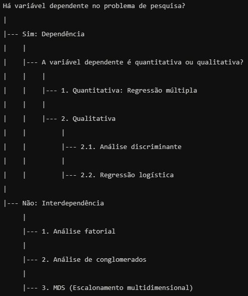
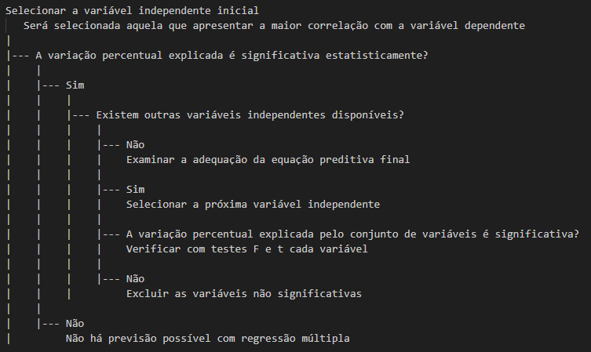
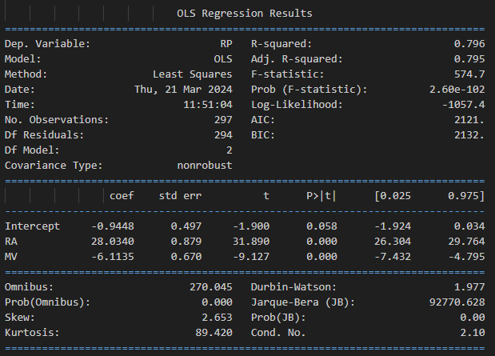
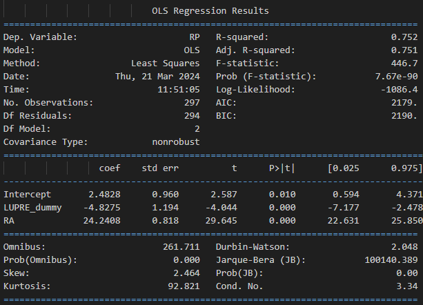

# Análise Multivariada de dados - Regressão Linear Múltipla

Aplicações em python com dados financeiros do livro Análise Multivariada da FEA-USP

 

## Regressão Linear Múltipla - Técnicas de dependência

file: regressao_linear_multipla.ipynb

 

## Resumo:

**Base de dados:**

* Origem: Revista Exame - 500 Melhores & Maiores
* Ano: 2001
* Empresas: Brasileiras de capital aberto, exceto bancos e seguros
* Variáveis:
    * **Dependente:** Rentabilidade do Patrimônio Líquido (RENTPL)
    * **Independentes:**
        * Rentabilidade do Ativo (RENTAT)
        * Alavancagem Operacional (ALOPER)
        * Alavancagem Financeira (ALFIN)
        * Margem Líquida de Vendas (MARVEN)
        * Lucro ou Prejuízo (LUPRE)
* Observações: 297

**Metodologia:**

* Regressão Linear Múltipla
* Método de busca seqüencial stepwise

**Etapas:**

1. Definição das variáveis
2. Análise descritiva das variáveis
3. Cálculo da matriz de correlação
4. Regressão Múltipla Stepwise
    * Seleção das variáveis
    * Avaliação do modelo

**Observações:**

* As primeiras fases da pesquisa (definição da amostra, coleta de dados, etc.) não são abordadas neste estudo.
* A variável "Lucro ou Prejuízo" é qualitativa, enquanto as demais são quantitativas.

**Bibliografia:**

* [https://pt.wikipedia.org/wiki/Regress%C3%A3o_por_stepwise](https://pt.wikipedia.org/wiki/Regress%C3%A3o_por_stepwise)
* FIPECAFI - Fundação Instituto de Pesquisas Contábeis, Atuariais e Financeiras. (2009). Análise multivariada: para os cursos de administração, ciências contábeis e economia. 1. ed. - 2. reimpr. São Paulo: Atlas.

**Resultados:**

**primeiro modelo:** 

 

* Estatísticas Gerais

- R-squared: 0.7963222749266814
- Adjusted R-squared: 0.7949367121710806
- F-statistic: 574.7284067125353
- Prob (F-statistic): 0.0

* Equação de Regressão

A equação de regressão obtida foi:
RP = -0.9448381400972627 + 28.03397045411322 * RA + -6.113507421618909 * MV

- Para cada aumento de uma unidade em 'RA', esperamos que 'RP' mude 28.03397045411322 unidades, assumindo que todas as outras variáveis permaneçam constantes.
- Para cada aumento de uma unidade em 'MV', esperamos que 'RP' mude -6.113507421618909 unidades, assumindo que todas as outras variáveis permaneçam constantes.

* Graus de Liberdade

- Graus de liberdade (regressão): 294.0
- Graus de liberdade (residual): 294.0

* Soma dos Quadrados

- Soma dos quadrados (regressão): 21515.436680945346
- Soma dos quadrados (residual): 21515.436680945346

* Quadrado Médio

- Quadrado médio (regressão): 73.18175741818145
- Quadrado médio (residual): 73.18175741818145

* F-statistic (ANOVA)

- F-statistic (ANOVA): nan
- Prob (F-statistic, ANOVA): nan

* Resultados do VIF

| VIF Factor | features |
|------------|----------|
| 7169.281698| NÚMERO   |
| 7273.504521| ID       |
| 4.404337   | vendas   |
| 2.458279   | plajust  |
| 4.194092   | llajust  |
| 4.646259   | ativoaj  |
| 7.096914   | RP       |
| 1.875624   | AO       |
| 2.808167   | MV       |
| 10.476515  | RA       |
| 1.871562   | AF       |
| 2.768700   | LUPRE    |

Valores de VIF maiores que 5 indicam alta multicolinearidade.

*  Testes de Diagnóstico

*  Durbin-Watson

- Durbin-Watson statistic: 1.976686766033608

*  Shapiro-Wilk

- Shapiro-Wilk test: W=0.35958659648895264, p=0.0

*  Conjunto de Testes

- R-squared para o conjunto de testes: 0.1412590339987353

**segundo modelo:** 
* segundo modelo: com variável dummy

 

*  ANOVA Results

| ANOVA results | df    | sum_sq          | mean_sq       | F             | PR(>F)       |
|---------------|-------|---------------==|---------------|---------------|--------------|
| LUPRE_dummy   | 1.0   | 1292.310936     | 1292.310936   | 14.525536     | 1.684288e-04 |
| RA            | 1.0   | 78185.741179    | 78185.741179  | 878.805358    | 2.514308e-90 |
| Residual      | 294.0 | 26156.654248    | 88.968212     | NaN           | NaN          |

*  VIF Results

| VIF Factor    | features    |
|---------------|-------------|
| 7169.281698   | NÚMERO      |
| 7273.504521   | ID          |
| 4.404337      | vendas      |
| 2.458279      | plajust     |
| 4.194092      | llajust     |
| 4.646259      | ativoaj     |
| 7.096914      | RP          |
| 1.875624      | AO          |
| 2.808167      | MV          |
| 10.476515     | RA          |
| 1.871562      | AF          |
| inf           | LUPRE       |
| inf           | LUPRE_dummy |

VIF values greater than 5 indicate high multicollinearity.

*  Durbin-Watson Statistic

- Durbin-Watson statistic: 2.0480888618088757
- Values close to 2.0 suggest no autocorrelation. Values towards 0 indicate positive autocorrelation, and values towards 4 indicate negative autocorrelation.

*  Shapiro-Wilk Test

- Shapiro-Wilk test: W=0.32806169986724854, p=0.0
- The first value is the W test value, and the second value is the p-value. A p-value less than 0.05 suggests the residuals are not normally distributed.

*  Regression Results

- R-squared: 0.7523857911019034. This is the proportion of the variance in the dependent variable that is predictable from the independent variables.
- Adjusted R-squared: 0.7507013407012361. This is the R-squared that has been adjusted for the number of predictors in the model.
- F-statistic: 446.6654469634921. This is a measure of how significant the fit of the model is. The higher the F-statistic, the more likely it is that the variables we used for predictions are correlated with the output and can help us predict it.
- Prob (F-statistic): 0.0. This is the probability that the null hypothesis is true (i.e., all of the regression coefficients are zero). The smaller the p-value, the stronger the evidence that at least one of the regression coefficients is not zero.

*  Regression Equation

The regression equation obtained was:
RP = 2.482754078929762 + -4.8275114934565675 * LUPRE_dummy + 24.240771584202506 * RA

- For every one-unit increase in 'LUPRE_dummy', we expect 'RP' to change by -4.8275114934565675 units, assuming all other variables remain constant.
- For every one-unit increase in 'RA', we expect 'RP' to change by 24.240771584202506 units, assuming all other variables remain constant.

*  Testing Set Results

- R-squared for the testing set: 0.47508484546253604
- The model explains a small portion of the variability in the target variable. It may not be a good fit for the data.

**Conclusões:**

apesar do R² ajustado no chegue a quase 80% e no segundo modelo 75%, percebe-se problemas de multicolinearidade nas variáveis utiliadas nos dois modelos e o teste de validação dos resultados no primeiro modelo o modelo explica muito pouco da variabilidade na variável-alvo (RP-RENTPL), em torno de 14%. Não é um bom ajuste para os dados. já no segundo modelo o modelo explica uma pequena parte da variabilidade na variável-alvo (RP-RENTPL), em torno de 47%. Também não é um bom ajuste para os dados.

